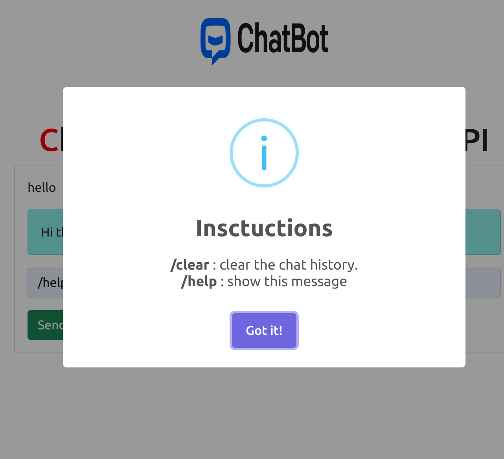

# Flask Chatbot

This is a simple Flask-based chatbot that uses the OpenAI GPT language model to generate responses to user prompts. The chat interface is built using HTML, CSS, and JavaScript, and uses the SweetAlert2 library for popup dialogs.

## Installation and Usage

1. Clone the repository:
```
git clone https://github.com/mokouchaoui/chatbot-flask.git
```

2. Install the required packages:
```shell
pip install -r requirements.txt
```

3. Set your OpenAI API key as an environment variable:
```
export OPENAI_API_KEY="your_api_key_here"
```

4. Run the application:


5. Open your web browser and go to `http://localhost:5000` to use the chatbot.

6 . Type ```/help ```to see the instructions or type your prompt.




## Configuration

The following configuration options are available in the `config.py` file:

- `DEBUG`: Set this to `True` to enable debug mode.
- `SECRET_KEY`: Set this to a secret key for your application.
- `OPENAI_API_KEY`: Set this to your OpenAI API key.
- `MODEL_ENGINE`: Set this to the OpenAI GPT model you want to use.

## Credits

- [OpenAI](https://openai.com/)
- [SweetAlert2](https://sweetalert2.github.io/)
- [Bootstrap](https://getbootstrap.com/)
- [Flask](https://flask.palletsprojects.com/)

## License

This project is licensed under the MIT License - see the LICENSE file for details.

